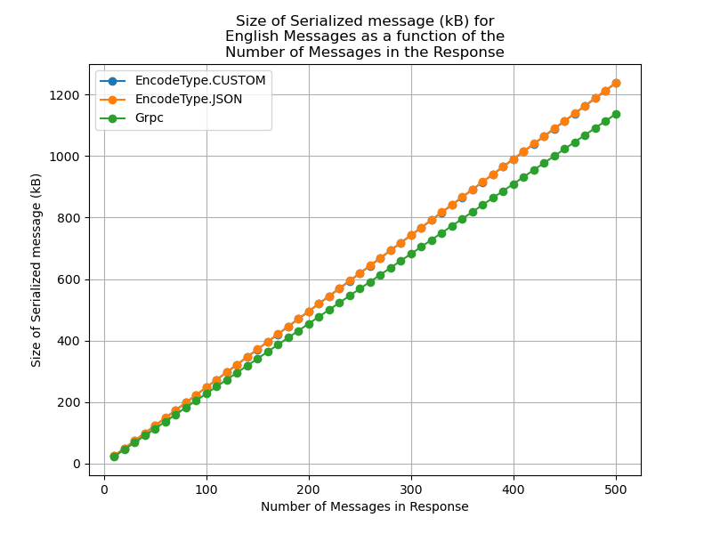
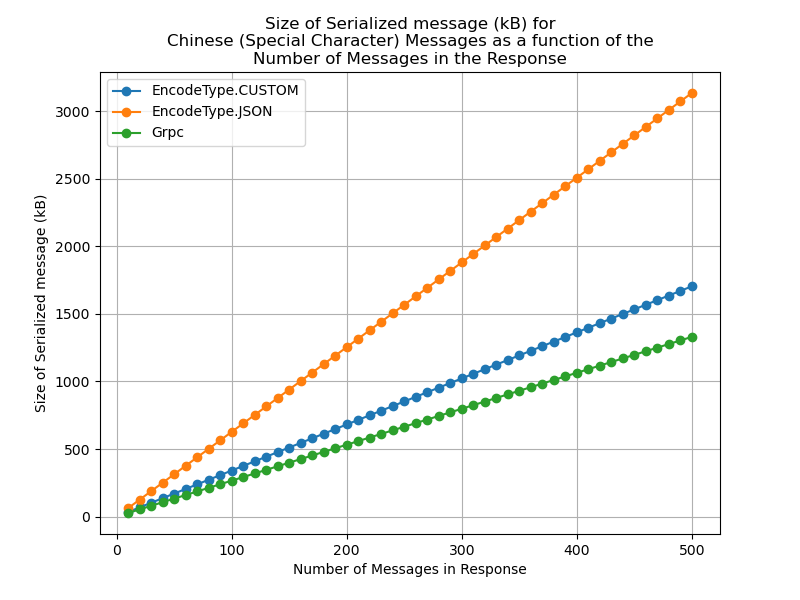

# Engineering Notebook

## Simplified Development with gRPC
Using gRPC simplified the application development in our case with its abstractions of low-level communication details. With gRPC, the client’s structure became much more intuitive: each operation is defined as an RPC function with clearly specified message structures (via the .proto file), allowing responses to be treated like local variables. Additionally, server responses can be treated as local variables in the same place the request is made rather than all of them being in a single event handler. This leads to cleaner, more maintainable client code compared to a custom protocol that requires manual parsing, unique IDs for tracking requests, and a monolithic event handler.

## Client-side Changes Overview (See more in Notebook Entries Below)
gRPC helped the client save a lot of lines of code by avoiding the need for serialization and creating and reading a buffer for server responses. It also avoided handling all responses in a single event handler. Structure-wise, we changed real-time messages from a broadcasting approach from the server to a polling approach, because we found it was much easier to implement using gRPC. 

## Trade-offs and Challenges
As a tradeoff for streamlining and abstracting away the vast majority of communication code/logic, we found that implementing features that fall out of its intended design (such as real-time asynchronous notifications) was more challenging and required some workarounds. (See more details in Notebook Entries below).

## Server-side Changes
So as to implement a Remote Procedure Call system for communication between the client and server, we choose to use gRPC, a library with ample documentation and code examples, making it easier to grasp, understand, and implement.

So as to expedite the process of implementing a simple gRPC protocol, we reduce the complexity of the server, while maintaining functionality. In particular, we rewrite the server such that there no longer exist dedicated user processes for each client. This eliminates the need for both the daemon process and for the user processes. As such, we have only a single database managing process. This greatly simplifies the implementation of gRPC, as the gRPC servicer class can now directly respond to requests by querying the database without needing to communicate with other processes.

Of particular note, we choose to make the server single-threaded, only instantiating a single worker. This is necessary given that because gRPC only instantiates a single servicer class, we must disable thread-checking in the SQLlite3 database, which asserts that multiple threads cannot access a single database access cursor. disabling thread-checking then necessitates that we as the developers rigorously prevent concurrency race-conditions. The easiest way to prevent this is to only have a single thread accessing the database, thus preventing concurrency issues by definition.

## Analysis of Difference
Overall, the main difference between gRPC and our custom and JSON wire protocols is that gRPC makes a specific data structure for each request. There are many benefits to this. First, it saves space by cutting down on unnecessary fields. In addition, gRPC automatically implements type checking and data validation to ensure that the data passed is as expected. This eliminates the need for tests on custom data validation checks (needed for both the custom and JSON wire protocols) Finally, gRPC abstracts away sockets, thus ensuring that we need not deal with the potential of multiple messages arriving from a single socket recieve, or a single large message being spread across multiple recieves. 

In terms of implementation, it was difficult to implement more complex features in gRPC, such as allowing the server to actively send an alert to a client without the client initiating a communication. As such, we chose to switch to having the client send a heartbeat signal that also served as a chance to get new messages. In addition, the process of catching users that terminated irregularly became difficult, particularly in terms of updating which users were online. As such, we implemented a try-catch wrapper around the client to catch all interrupts and initiate a graceful log-out under all circumstances.

In terms of benchmarking, we analyzed the size of the response object containing some number of messages, so as to be comparative with our earlier tests on our own wire protocols

#### Size of Serialized response as a function of Message Size (Message count):

  
  

We can see that for normal english messages, the gRPC representation of the messages is slightly more efficient than the Custom and JSON wire protocol implementations, which are roughly equivalent. For special characters, such as chinese messages, the gRPC representation is more efficient than the custom wire protocol, which is more efficient than the JSON wire protocol. However, in all cases the difference is roughly by a linear factor.

For our comparisons, two things must be noted. First, is that the gRPC request and response sizes vary by the actual amount of data sent. While our wire protocols have set fields that are used across different requests, gRPC has a separate data structure for each request type and response type, allowing for greater optimization of space. However, this difference is only by a constant amount per message. More importantly however, is to note that gRPC uses HTTP to send data. As such, the raw size of the request and response are not necessarily reflective of the amount of information that is being sent over the network. While we attemped to implement a packet sniffer analysis code, so as to determine the true size of the gRPC objects over the network, we found ourselves facing barriers in implementation, and thus opted to only examine the raw request and response sizes. However, the fact that gRPC uses HTTP may mean that the actual amount of data being transfered over the network is more for gRPC than for our wire protocols that directly feed serialized bytes through a socket. 

## Testing
We implement two main types of testing. First we implement unit tests in tests.py, which rigorously test all functionalities within the server. Second, we design a terminal client, which in combination with the regular client, allow for integration testing and roleplaying-based testing. In particular, the terminal client allows for fast verification of whether specific bugs were a result of the client tkinkter code, or the server code, allowing for expidited debugging.

Of particular note for the unit tests, given that the server must be started to run the unit tests, and the databases must be cleared, we write a simple shell script that achieves this, which can be executed with "./tests.sh," potentially after running "chmod +x tests.sh" to ensure that the script has execute permissions.

# Entries

## 2/25

### Client-Side Changes to Real Time Message Delivery
- We ran into bugs with the streaming method for receiving realtime notifications upon message deliveries, so we instead switched to a polling approach: Every .5 seconds, the client queries messages again to check if any new ones came in (and handles any new messages accordingly). With sockets and tkinter's event listener (which worked on sockets but does not work for gRPC), we could simply have the server send a message to the client at any time it chose to. However, just polling for new messages was by far the simpler solution with gRPC.
- This (among other things) exemplified the fact that while gRPC is a very useful abstraction in many ways, and it makes things like function calls and inter-system communication much simpler (i.e. things it is specifically fine-tuned to abstract away), it is much more difficult to implement features that gRPC was not designed to do.
- Spent a good amount of time just debugging new logic with gRPC implementation.
- Fixed bugs related to closing the client/server while the other is still running:
    - Prematurely closing the client: This caused the server to think the client was still logged in. To fix this, we added a logout message to the server when either the TKinter window closes or the user keyboard interrupts the program.
    - Prematurely closing the server: This caused every message the client sent to the server to raise a gRPC exception. This was a big problem because the client polls the server 2 times a second (which means they just receive a flood of errors). To fix this, we had to make 2 changes. First, we exit the client program if `query_messages()` raises an error when it is called by `check_incoming_messages()`. This way, we don't keep on querying the server for messages every 0.5 seconds when we know that it already raised an exception. Second, we also exit the client program even if it does not receive a logout confirmation from the server upon closing the window &mdash; this ensures the user doesn't get stuck in a loop of trying to close the window due to an error, which raises another error from telling the server that the client logged out.

### Structural Differences
- The ability to essentially treat server responses as local variables is very noticeable in the code. Instead of processing all the responses in one big conditional in the TKinter event handler, we can just treat the response like a local variable whose value is set right as the request is sent out. This makes the logic and struture of the client code much clearer.

### Ease of Use
- gRPC's abstractions make this an easier out-of-the-box solution than implementing our own custom wire protocol. However, we recognize that this is in part because we are implementing some very common and basic functionalities, and once we get into more custom uses/datatypes/etc, having to tailor our approach and structure to accomodate gRPC's supported features may likely end up being more work than just creating our own protocol.

## 2/24

### Initial Thoughts
- Don't have to do much parsing &mdash; behaves more like JSON, where you can directly access variables, as opposed to coming up with an encoding and decoding scheme as part of processing
- The logic/logical structure gets handled in the `.proto` file instead of backend code. Our custom protocol handled all the logic in the backend, while using RPC abstracts much of the schema definition, etc to the `.proto` file.
- More specific error messages

### Structural/Design Differences
- Instead of having an operation code and the server parsing every operation and associated data, we essentially define an RPC function for every operation (along with associated message structures to standardize across systems)
- Simplified client-side code: instead of needing a lot of logic to handle sending a message to the server and waiting for confirmation, all we need to do is make the object(s) and call the RPC function to send it to the server (and get the response)
- Client-side logic for requests seems to be divided in a much more intuitive way. Relevant code that should be executed following confirmation of a successful request now lives in the same function as the request, as opposed to our original implementation, which handled all of them in the event handler function and needed to verify by keeping a dictionary of pending requests and generating unique IDs.

### Delivering Messages to Online Users in Real Time
- With sockets, we were able to add a TKinter event listener on the server socket to handle incoming messages. This meant the client could always receive a message from the server in real time, so the server could just send a message to an online user whenever one came in. However, with gRPC, we can't have this sort of asynchronous behavior. Instead, we make a client thread solely for subscribing to alerts from the server via blocking. (We stream these alerts from the server to the client so they aren't limited to immediately when the client requests/subscribes &mdash; they can come in to the client whenever, as long as the connection is still open).

### Testing
- Since we chose to remove the database class and instead chose to integrate it directly into the RPC function implementations, we cannot test the database on its own, and must instead test solely through RPC function calls. If we wanted to also test the database on its own, we could have abstracted it away into its own class and made those function calls within the RPC functions.